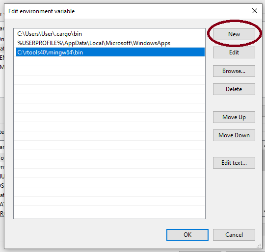

# rnmrfit

This package implements NMR lineshape fitting using the real and imaginary components of the data in the frequency domain. The core of the algorithm is built around the NLOPT nonlinear optimization library with a number of helper scripts designed to facilitate working with NMR data.

More information can be found in the accompanying article: https://doi.org/10.1016/j.jmr.2018.11.004

## Recent updates

All of the underflying fitting code has been ported to Rust, which should considerably speed up fitting at the cost of making the installation more difficult for Windows users. Much of the R code has also been modified to enable better integration with 2D fitting.

## Installation

The recent changes introduce two external dependencies that need to be installed for the package to work: Rust and CMake. It is also recommended that NMR users who are not as familiar with R also install RStudio to serve as a graphical interface.

Note: this might be just me, but I've recently had issues updating R and R packages. I recommend updating all packages and ensuring your R installation is up to date before installing this package.

### Linux

The recommended method to install Rust is via install script:

```
curl --proto '=https' --tlsv1.2 -sSf https://sh.rustup.rs | sh
```

Follow the prompts and make sure that `cargo` is on your `PATH`. You should then only need some compilation tools and CMake. Assuming Ubuntu:

```
sudo apt install build-essential cmake
```

The `rnmrfit` package can be installed directly from GitHub using `devtools`:

```
#!R

library(devtools)
install_github('ssokolen/rnmrfit', ref = 'rust')
```

### Windows (64 bit)

It seems like getting Rust and R talk to each other is a bit more finicky on Windows. The following instructions result in a successful install on a fresh Windows 10 virtual machine, but your mileage may vary.

First, install [Cmake](https://cmake.org/download/) and then [VisualStudio with C++](https://visualstudio.microsoft.com/vs/features/cplusplus/) (Community 2019 is fine). You should now be able to install [Rust](https://www.rust-lang.org/tools/install) (just choose the default installation options).

You will then need to add a new compilation target that works with R. Open the Windows Command Prompt (you can just search for "Command Prompt" in the toolbar search) and type in the following:

```
rustup target add x86_64-pc-windows-gnu
```

Click enter; you can close the shell once everything is downloaded and installed. It seems like both `windows-msvc` and `windows-gnu` targets are needed for everything to work so I do not recommend using the `windows-gnu` target when you first install Rust. 

If the following are not already installed, install [Rtools40](https://cran.r-project.org/bin/windows/Rtools/), [R](https://cran.r-project.org/bin/windows/base/), and [RStudio](https://rstudio.com/products/rstudio/download/#download) in that order.

You will need to add Rtools to your path, this is done via "Edit the system environment variables" option in the Control panel. This is easiest to access by just searching "Path" in the toolbar search


You will then need to click on the "Environment variables" button in the bottom right


and then Edit the Path variable


Add a New path to where you installed Rtools (likely "C:\rtools40\mingw64\bin")



At this point, you should now be able to launch RStudio and install `rnmrfit` using the `devtools` package:

```
#!R

install.packages('devtools')
library(devtools)
install_github('ssokolen/rnmrfit', ref = 'rust', INSTALL_opts='--no-multiarch')
```

This will only install the 64-bit version, which should be sufficient for most use cases. I personally couldn't get multi-architecture installation to work properly on my computer, but I also don't use Windows much.

## Tutorials

Under development...
